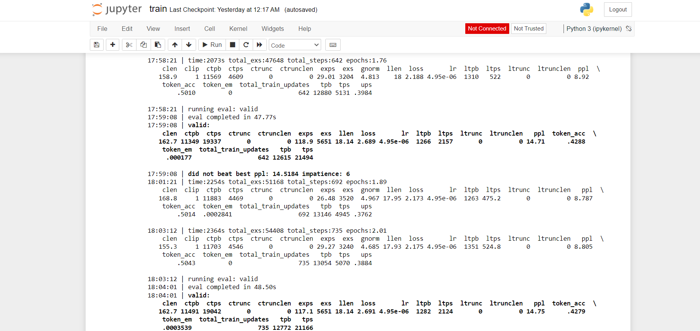
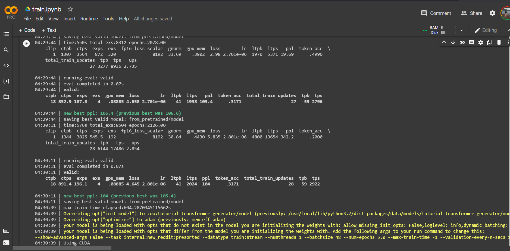
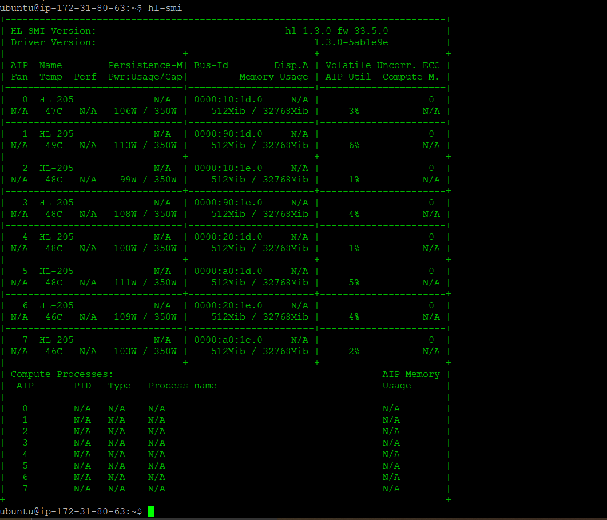
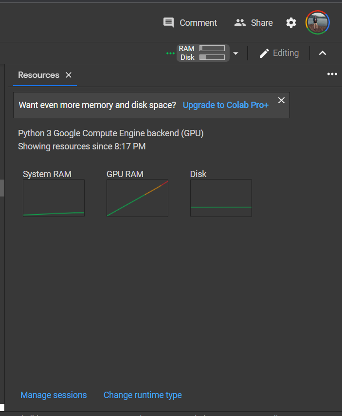
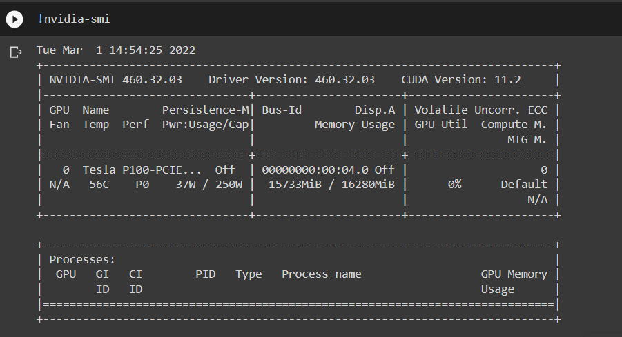

# language-model-training-on-habana
Training a Million parameter language model on AWS Habana EC2 instance with Gaudi Accelerator to help people in a war zone to reduce their mental issues.
## Inspiration
Since Russia launched a full-scale military invasion into Ukraine on February 24, 2022, fighting has caused over one hundred civilian casualties and pushed tens of thousands of Ukrainians to flee to neighboring countries—including Poland.  During war, people can be exposed to many different traumatic events. That raises the chances of developing mental health problems—like post-traumatic stress disorder (PTSD), anxiety, and depression—and poorer life outcomes as adults.
Sometimes all they need is someone to talk, someone to make them feel better, and someone to share their feelings. 
# Installation and Run
## Local Installation
1. Select the Habana base AMI which contain the OS image and the Habana driver and SynapseAI Software Stack. [link](https://aws.amazon.com/marketplace/search/results?searchTerms=Habana)
2. After launching the EC2 instance, install PyTorch using [link](https://github.com/HabanaAI/Setup_and_Install/tree/main/installation_scripts/PyTorch)
3. Install Jupyter Notebook on root using command
```sh
sudo pip install jupyter notebook
```
4.clone this repository. After setting the AWS inbound rule, opened to 8888 port run
```sh
git clone https://github.com/kishorkuttan/language-model-training-on-habana.git
cd language-model-training-on-habana
sudo jupyter notebook --ip=* --allow-root
```
go to **https://<your instance public ip4 >:8888**
5. run train.ipynb
# Benchmarking Habana Gaudi Accelerator Vs Tesla P100 from Colab
## Training

<p float="left">
  
   

</p>

## Hardware Usage
<p float="left">
  
   
   

</p>

**After benchmarking we closely monitored the performance and we got far better performace of Habana Gaudi AWS instance compared to Colab Pro.**

## ParlAI
A unified platform for sharing, training and evaluating dialogue models across many tasks. 

# Datasets Used For Fine-Tuning
1. BlenderBot 90 M.[link](https://huggingface.co/facebook/blenderbot-90M)
2. Empathetic.[link](https://arxiv.org/abs/1811.00207)
3. Paper.[link](https://arxiv.org/abs/1811.00207) 
# TO DO
1. The trained language model can be deployed as an API. Which means we can even built a mental health helpline number with our trained conversational AI as backend to help them feel connected.

